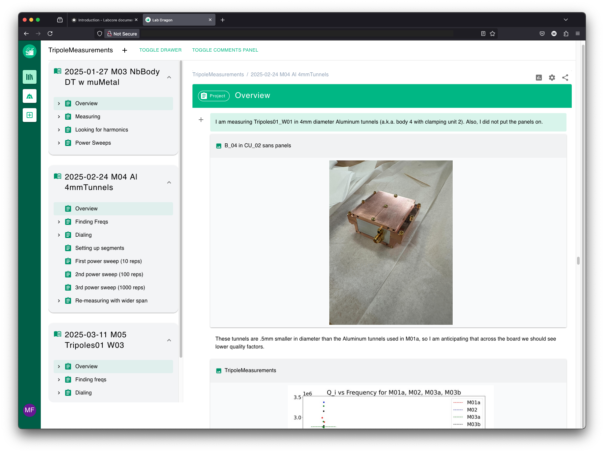

# Lab Dragon

Lab Dragon is a research data management system designed to streamline the tracking, organization, and visualization of experimental data. Built with a Connexion backend (Flask) and a NextJS frontend, it provides an intuitive interface for researchers to manage their notebooks, experiments, and results.

The system allows users to create structured notebooks, store experimental data, and visualize results through a web interface. Lab Dragon helps maintain data provenance and reproducibility while offering tools to collaborate with team members.



We are still early in development with a lot of work needed to expand the feature set and allow Lab Dragon to run in a wider set of environments.

## Requirements

Lab Dragon uses file paths as unique identifiers for data and resources. For this reason, it requires consistent environments across all machines in your research setup:

1. **Central data storage**: All data and notes should be located in a central place like a NAS or some sort shared storage system. A NAS is preferred. 

2. **Operating System Consistency**: All computers that interact with the same Lab Dragon instance should run the same operating system.

3. **Username Consistency**: User accounts on all machines should have identical usernames.

4. **File Structure Consistency**: Directory structures should be maintained consistently across machines.

These requirements ensure that file paths remain valid as identifiers when accessing the system from different computers, maintaining data integrity and preventing broken references.

## Quickstart

The easiest way to run Lab Dragon is through the docker-compose file at the root of the repository:

1. Copy the example `.env` file to create your own configuration:
   ```bash
   cp example.env .env
   ```

2. Modify the `.env` file to match your system configuration (see the Environment Variables section below)

3. Start the system using Docker Compose:
   ```bash
   docker-compose up -d
   ```

4. Access the application at http://localhost (or the HOST you specified in your .env file)

## Environment Variables

The `.env` file configures the Docker Compose setup. Here's what each variable means:

| Variable | Description |
|----------|-------------|
| `COMPOSE_PROJECT_NAME` | The name of the Docker Compose project (default: dev) |
| `HOST` | The hostname that will be used to access the system (default: localhost) |
| `IMAGE_HOME_DIRECTORY` | The directory path inside the Docker container that maps to your central data storage (NAS). This should match how your measurement computers access this storage. |
| `IMAGE_MAPPING_DIRECTORY` | The directory on your host machine that will be mounted into the container. This should point to your central data storage location. |
| `LAIRS_DIRECTORY` | Path where Lab Dragon stores its TOML configuration files (users, data buckets, libraries, etc.). This path is from the perspective of the Docker container. |
| `RESOURCE_PATH` | Directory where Lab Dragon stores generated images and other content. This path is from the perspective of the Docker container. |
| `API_URL_PREFIX` | The URL where the API is accessible. For production, this should be `HOST/api` (e.g., if HOST=mywebsite.com, use mywebsite.com/api). For development with separate frontend/backend servers, this may differ. |
| `URL_HOST` | The URL where the frontend is accessible. For production, this should match the `HOST` value. For development with separate frontend/backend servers, this may differ. |
| `USERS` | A JSON-formatted string defining user accounts. Format: `"{'email@domain.com':'Full Name', 'another@domain.com':'Another Name'}"` |

## Docker Images

Lab Dragon uses the following Docker images:

1. **marcosf2/dragon-core**: Contains the backend Connexion/Flask API
2. **marcosf2/dragon-scales**: Contains the frontend NextJS application

These images are built from the corresponding directories in the repository (dragon-core and dragon-scales) when you run the docker-compose file.

## Development Environment

If you prefer to run the backend server locally for development:

1. Create a new Python virtual environment using conda:
   ```bash
   conda env create -f dragon-core/environment.yml
   ```

2. Activate the environment:
   ```bash
   conda activate lab-dragon
   ```

3. Manually install the swagger-ui package:
   ```bash
   pip install 'connexion[swagger-ui]'
   ```

4. Install the dragon-core package in editable mode:
   ```bash
   cd dragon-core
   pip install -e .
   ```

5. Start the server by running:
   ```bash
   python api/starting_app.py
   ```
